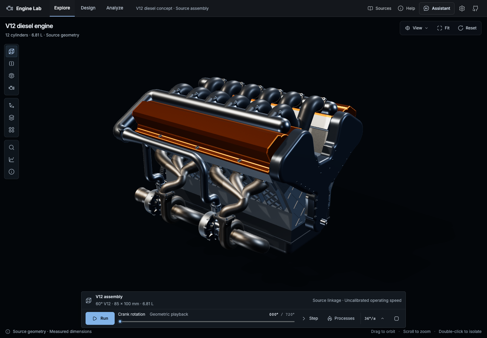
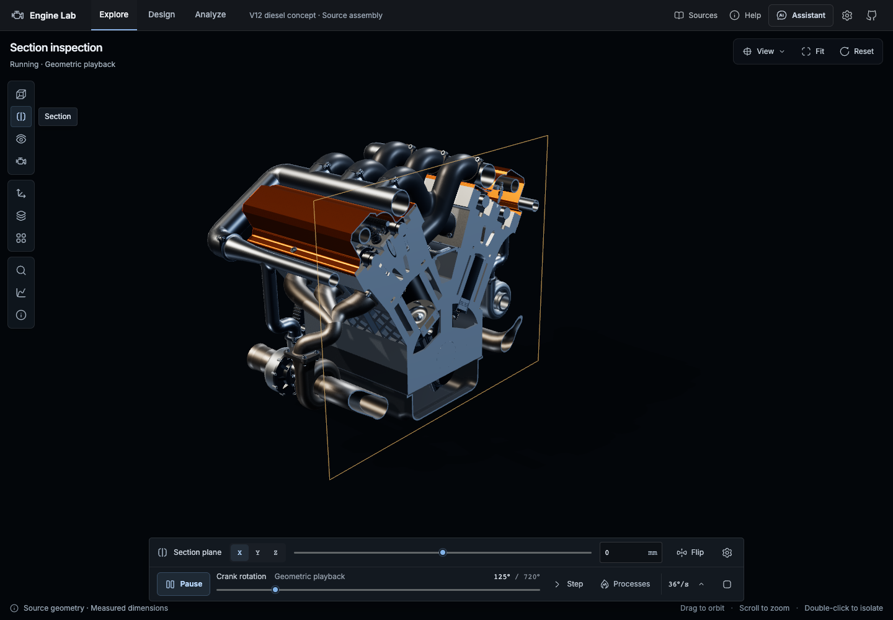
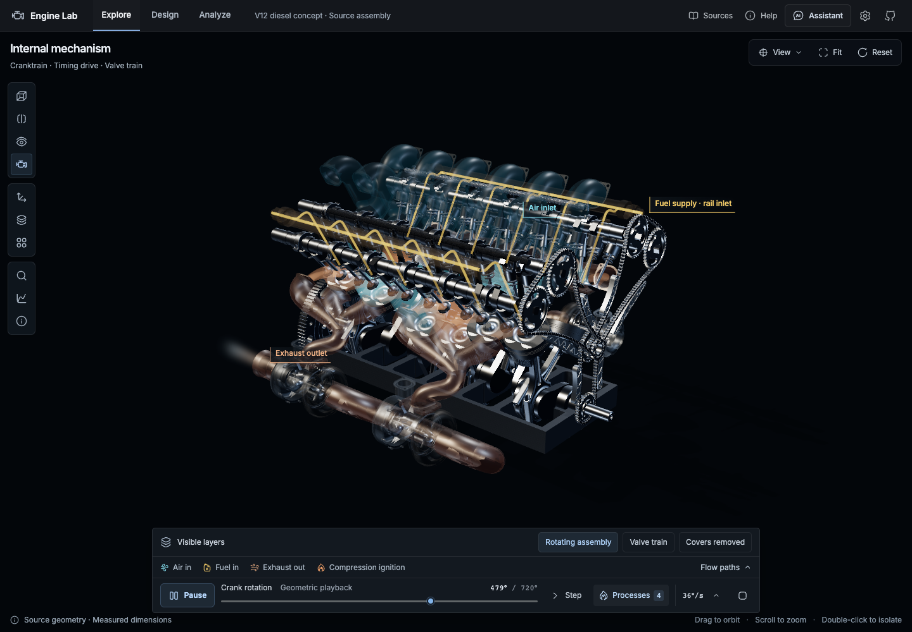
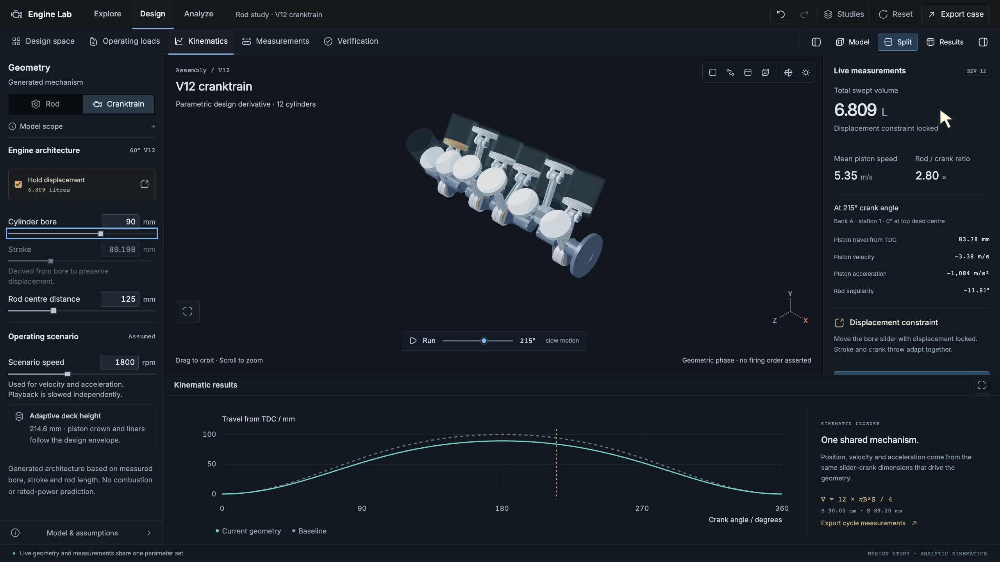
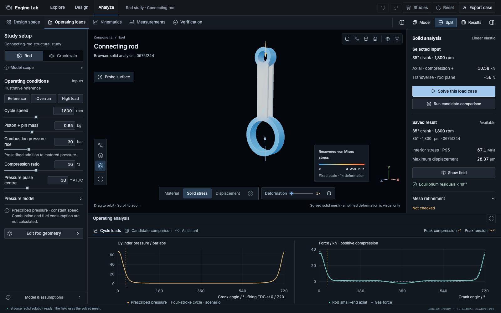
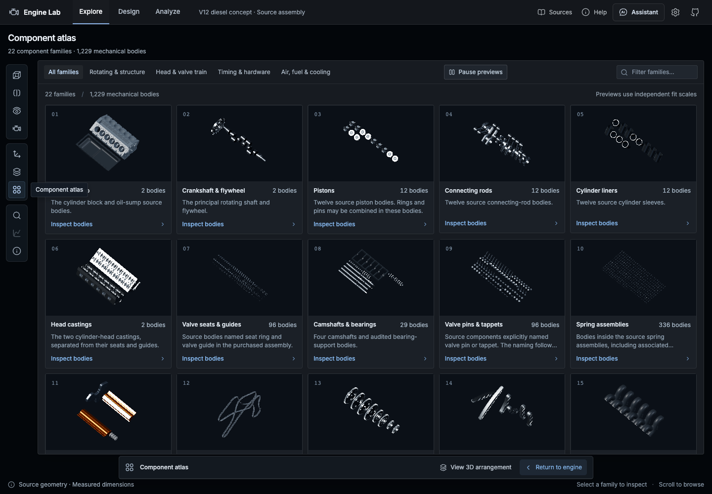

# Engine Lab

A browser-based workspace for inspecting a V12 diesel concept, changing parametric geometry, and comparing engineering calculations with their assumptions and verification evidence.



[Run locally](docs/RUNNING.md) · [Computation and verification](docs/COMPUTE_ARCHITECTURE.md) · [Static deployment](docs/DEPLOYMENT.md) · [Engineering scope](#engineering-scope)

**The `browser-first` branch runs geometry, meshing, structural analysis and design searches in the browser.** Its built application is static files: no application server, Python installation or native solver service is required. Optional AI uses the visitor’s own OpenAI key and calls OpenAI directly; language-model inference is remote.

## Workspaces

| Workspace   | Capabilities                                                                                                                                                                                                                   |
| ----------- | ------------------------------------------------------------------------------------------------------------------------------------------------------------------------------------------------------------------------------ |
| **Explore** | Inspect 1,229 mechanical bodies across 22 families. Run the linkage, isolate components, move a section plane, reveal internals with X-ray, separate the assembly and browse the component atlas.                              |
| **Design**  | Adjust a generated cranktrain and five-parameter connecting-rod family. Inspect dimensions, displacement, motion, mass and section properties. Verify the exact solid and export STEP locally.                                 |
| **Analyze** | Calculate prescribed operating loads, screen a bounded design space with WebGPU, and solve three-dimensional rod elasticity in a browser worker. Compare stress/displacement fields, mesh refinement and saved study evidence. |

The assembly assistant can search registered components, execute acknowledged scene operations and explain curated sources. The design assistant interprets the current numerical study. Guided lessons and a phase-linked air-standard cylinder study use the same inspection controls.

<table>
  <tr>
    <td><a href="docs/verification/webgpu-engine-section-settled.png"></a><br /><strong>Section inspection</strong><br />Position and orient a plane through the source assembly.</td>
    <td><a href="docs/verification/webgpu-engine-mechanism-processes.png"></a><br /><strong>Mechanism and processes</strong><br />Connected motion with phase-aligned explanatory layers.</td>
  </tr>
  <tr>
    <td><a href="docs/images/parametric-cranktrain.webp"></a><br /><strong>Parametric geometry</strong><br />Dimensions, measurements and plots update together.</td>
    <td><a href="docs/verification/packaged-static-solid-result.png"></a><br /><strong>Browser solid analysis</strong><br />Actual static-build result; 3D elements, explicit loads and equilibrium checks.</td>
  </tr>
</table>

<details>
<summary>Component atlas</summary>



The atlas uses the same component identities as selection, isolation and the assistant. Gallery previews have independent fit scales; assembly views preserve component scale.

</details>

The Explorer images are current native-WebGPU captures, and the solid-analysis image is from the verified browser-first static build. The parametric-cranktrain image is retained from the earlier tour and **predates the runtime migration**; it illustrates the interface, not its former backend architecture. [Screenshot provenance](docs/images/README.md) records that original frame. [Renderer evidence](docs/verification/webgpu-engine-smoke.json) and [process verification](docs/verification/process-webgpu.md) accompany the current images. Process overlays are explanatory; deformation magnification changes presentation, not calculated values.

## Quick start

Use **Node 24** and **pnpm 12.4.2** to build or develop the project. Visitors to a hosted build need only a supported browser.

```sh
git clone --branch browser-first https://github.com/NeoVand/Diesel.git
cd Diesel
npm install --global pnpm@12.4.2
pnpm install --frozen-lockfile
pnpm dev --host 127.0.0.1
```

Open the URL printed by Vite, normally **http://127.0.0.1:5173**. Design and Analyze work without the commercial Explorer meshes. No `.env` file or Python environment is needed.

To serve the production output as static files:

```sh
pnpm build
node scripts/serve-static.mjs --port 4198
```

Open **http://127.0.0.1:4198**. This verification server only serves files and deliberately returns 404 for `/api/`. A normal static host can serve the same `build/` directory.

### Explorer assets

The release includes the complete processed Explorer model as compressed, encrypted application resources. Original editable vendor files and loose runtime geometry remain outside the public source checkout. This packaging discourages direct reuse; a browser must eventually decode geometry to display it, so it cannot make extraction impossible.

Independent clones can import five matching runtime files into the browser’s IndexedDB; nothing is uploaded. Owners can also supply them locally under `static/models/`. Public metadata needed to build the application is included. The generated Design and Analyze workspaces do not depend on the purchased mesh.

The original vendor download alone does not reproduce the corrected runtime bundle. Obtain that versioned bundle through an authorised project handoff. [The rerun guide](docs/RUNNING.md#explorer-assets) lists the files and the remaining conversion-toolchain boundary.

### Optional AI

Open **AI connection settings** in Explore or **Connect AI** in Analyze. Enter your own OpenAI API key and an accessible model. The key stays in tab memory, survives workspace navigation, and is cleared by reload or disconnect. Questions, selected context and study summaries go directly to OpenAI; meshes are not sent. Narration is AI-generated speech. API usage belongs to the visitor’s OpenAI project.

The browser implements the Responses API tool loop. It does not launch the native Codex harness. Shared host-key/password access from the earlier implementation is not part of this static edition. ElevenLabs was used to narrate the recorded tour, not as an application dependency.

## Where computation runs

| Work                                                     | Implementation                                                                                  | Runtime                                        |
| -------------------------------------------------------- | ----------------------------------------------------------------------------------------------- | ---------------------------------------------- |
| Interface                                                | Svelte 5, SvelteKit, TypeScript, Hugeicons                                                      | Browser                                        |
| Geometry rendering and visual process layers             | Three.js native WebGPU, node materials, filled sections and WGSL volumetric layers              | Browser GPU                                    |
| Linkage, cylinder integration and reference calculations | Measured geometry, ideal-air RK4 cycle, analytic/Float64 calculations                           | Browser CPU and workers                        |
| Operating design screening                               | JAX-JS batched force/stress calculations; independent Float64 checks and finalist refinement    | Browser WebGPU, with browser CPU fallback      |
| Exact rod CAD and STEP                                   | Open CASCADE through Gmsh WebAssembly                                                           | Browser worker / WASM                          |
| Solid finite-element analysis                            | Gmsh tetrahedral mesh; Float64 sparse CSR assembly and IC(0)-preconditioned conjugate gradients | Browser worker                                 |
| Assistant and narration                                  | Local tool execution; direct OpenAI Responses and speech requests                               | Browser orchestration; remote OpenAI inference |

**WebGPU rendering and numerical compute are implemented.** Every live 3D viewport uses a native WebGPU backend. JAX-JS accelerates the operating-search screen, while exact CAD, double-precision solid FEA and independent reference checks use browser CPU/WASM. The renderer explicitly rejects unsupported devices instead of silently falling back to WebGL.

For one recorded 500-design, three-condition search on an Apple Metal WebGPU adapter, total GPU-path wall time was **194 ms**, including verification and refinement, versus **528 ms** for the Float64 CPU path. All candidate pass/fail decisions and finalists agreed. These are machine-specific measurements, not a general speed guarantee. The [full report](docs/verification/browser-webgpu.json) includes other cases, precision errors and provenance.

## Verification

The browser CAD/FEA checks compare independently remeshed solutions with saved native reference fixtures. Baseline displacement differed by **−0.4784%**; a thin candidate with inertia differed by **+0.0485%**. A real static-build browser session exported STEP and solved the displayed solid load case with `/api` unavailable. [Formulation, residuals, timings and limits](docs/verification/browser-cad-solid.md) accompany the results.

```sh
pnpm exec playwright install chromium chrome
pnpm check
pnpm exec vitest run --project server src/lib/ai src/lib/browser-cad src/lib/design
node scripts/verify-webgpu.mjs --output /tmp/engine-lab-webgpu.json
pnpm build
```

The Vitest project named `server` is the Node-based **test runner**, not a deployed application backend. The WebGPU check launches an actual browser. Complete Explorer tests additionally need the licensed files; see [verification instructions](docs/RUNNING.md#verification).

## Deployment

Deploy the generated `build/` directory to a static host. GitHub Pages, a static Cloudflare/Vercel site, or an ordinary web server can serve this application. The CAD/meshing WASM build needs cross-origin isolation: the project supplies COOP/COEP headers for local serving and an isolation service worker for hosts such as Pages.

The branch includes CI and a GitHub Pages workflow that runs on pushes to `main` or manual dispatch. **A workflow file is not evidence of a published site; no public deployment is claimed here.** [Deployment instructions](docs/DEPLOYMENT.md) cover the `/Diesel` base path, isolation, assets and the static container profile.

## Engineering scope

The source is a purchased **60° V12 diesel concept**, measured at **85 mm bore × 100 mm stroke**, approximately **6.81 L**. It is not an identified OEM production master or a verified engine rating.

- **Geometry and motion:** imported source bodies include documented timing, valvetrain and clearance corrections. The connected teaching cycle does not establish production firing order, hot-running clearance or physical material grades.
- **Processes:** passage fields, reduced fuel spray and combustion glow explain route and timing. They do not predict emissions, calibrated flame temperatures or fuel consumption.
- **Parametric scope:** the generated cranktrain and rod family adapt to their parameters. The complete purchased assembly is not regenerated or proven compatible with every change.
- **Distinct numerical models:** the ideal-air cylinder study, beam screen, prescribed-pressure operating loads and 3D linear-elastic rod model answer different questions. Their assumptions and fixtures accompany their outputs.
- **Design acceptance:** sampled mass/stress tradeoffs and numerical verification do not establish bearing contact, fatigue, thermal stress, nonlinear response, manufacturing feasibility or experimental validation. The sharp-shoulder rod omits bolts, cap joints, bushings and fillets; fixture/edge peak stresses can be singular.

## Controls

| Action                               | Control                    |
| ------------------------------------ | -------------------------- |
| Orbit / zoom / pan                   | Drag / scroll / right-drag |
| Isolate a component                  | Double-click it            |
| Run or pause                         | `Space`                    |
| Explode or assemble                  | `E`                        |
| Component atlas                      | `G`                        |
| Section or assembly                  | `C`                        |
| Fit the current view                 | `F`                        |
| Stop the current interaction or tour | `Esc`                      |

## Project map

| Path                                         | Purpose                                                                            |
| -------------------------------------------- | ---------------------------------------------------------------------------------- |
| [`src/lib/scene`](src/lib/scene)             | Rendering, sections, materials, mechanism and process presentation                 |
| [`src/lib/engine`](src/lib/engine)           | Engine identity, measured data, local asset imports, timing and cylinder equations |
| [`src/lib/design`](src/lib/design)           | Parametric mechanics, JAX-JS kernels, search workers and saved study contracts     |
| [`src/lib/browser-cad`](src/lib/browser-cad) | WASM exact solids/meshing and browser Float64 elasticity                           |
| [`src/lib/ai`](src/lib/ai)                   | Memory-only BYOK, validated browser scene tools and direct OpenAI requests         |
| [`docs/verification`](docs/verification)     | Numerical and browser evidence, with dates and runtime provenance                  |
| [`src/lib/server`](src/lib/server)           | Historical native reference implementations and tests; not deployed routes         |

[Running-engine implementation](docs/V12_RUNNING_ENGINE_RELEASE.md) · [Cylinder equations](docs/V12_AIR_STANDARD_CYCLE.md) · [Operating-load derivation](docs/OPERATING_DESIGN_VERIFICATION.md) · [Browser CAD/FEA verification](docs/verification/browser-cad-solid.md)

Earlier Caterpillar research and Node/Python setup instructions are historical. [Archived baseline documentation](docs/archive/README_NODE_BASELINE.md) preserves the earlier architecture; it is not the current run guide.

## Asset rights and dependencies

The purchased engine is [V12 Quad Turbocharged Diesel Engine by Y-Studio19](https://www.cgtrader.com/3d-models/industrial/industrial-machine/v12-quad-turbocharged-diesel-engine-cf492efc-f63a-4c18-86c7-d3bd0948c20d). The commercial geometry is licensed separately from the application source. The hosted demonstration incorporates processed model resources; it does not grant visitors a standalone model licence or redistribute the editable vendor project. Independent deployments must respect the model’s licence and [CGTrader’s incorporation and resource-protection requirements](https://help.cgtrader.com/hc/en-us/articles/360015124437-Royalty-Free-License). Screenshots do not grant rights to the model.

Built with [SvelteKit](https://svelte.dev/docs/kit/introduction), [Three.js](https://threejs.org/), [Hugeicons](https://hugeicons.com/), [JAX-JS](https://github.com/ekzhang/jax-js), [Gmsh WASM](https://github.com/loumalouomega/GMSH-JS), [Open CASCADE](https://dev.opencascade.org/) and the [OpenAI API](https://developers.openai.com/api/docs/guides/function-calling). Build preparation places Gmsh’s licence and source provenance beside its WASM files under `vendor/gmsh/`. Gmsh is GPL-2.0-or-later; preserve its licence and corresponding-source obligations when distributing the application. Other dependencies retain their respective licences.
