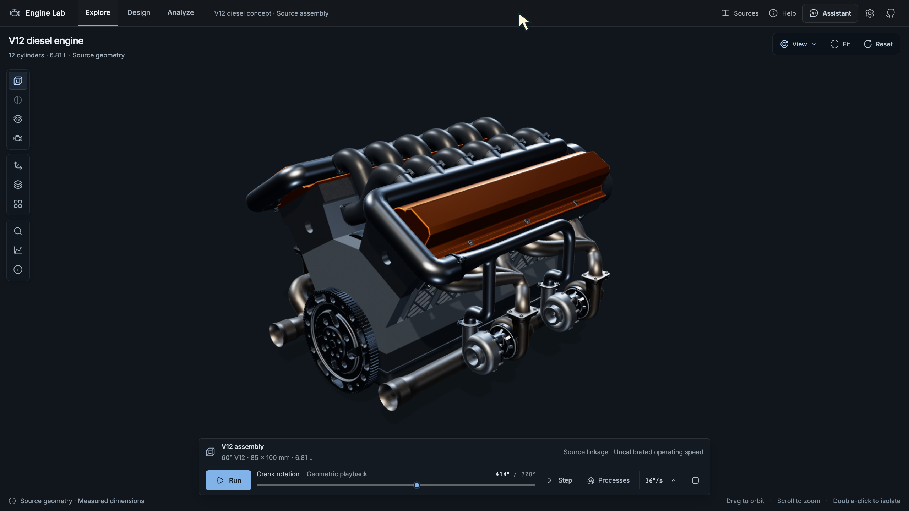
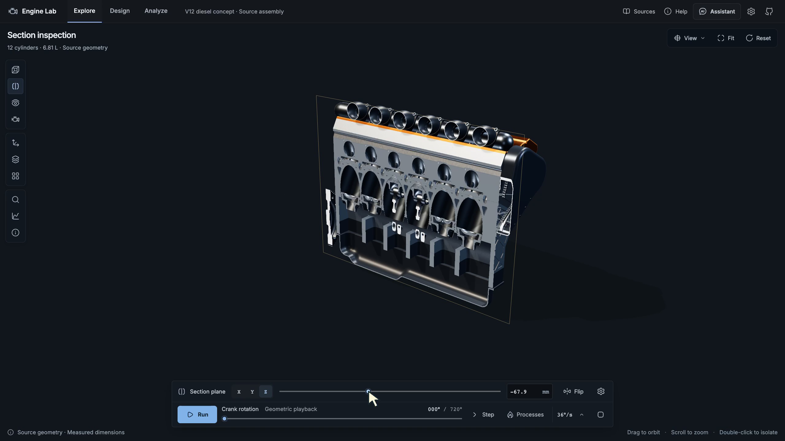
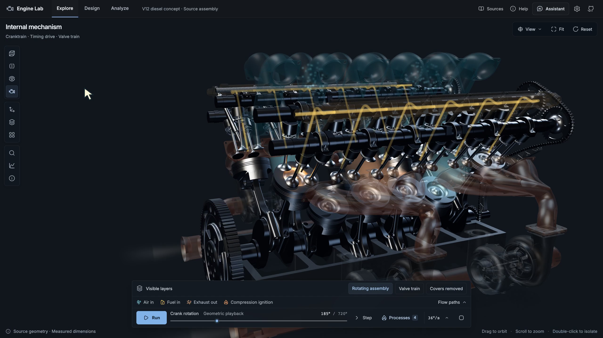
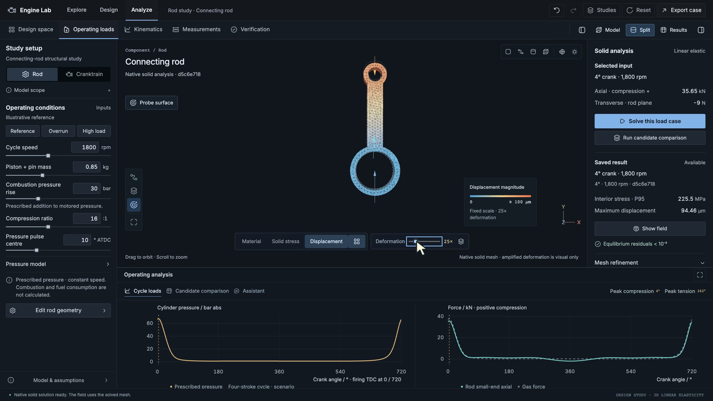
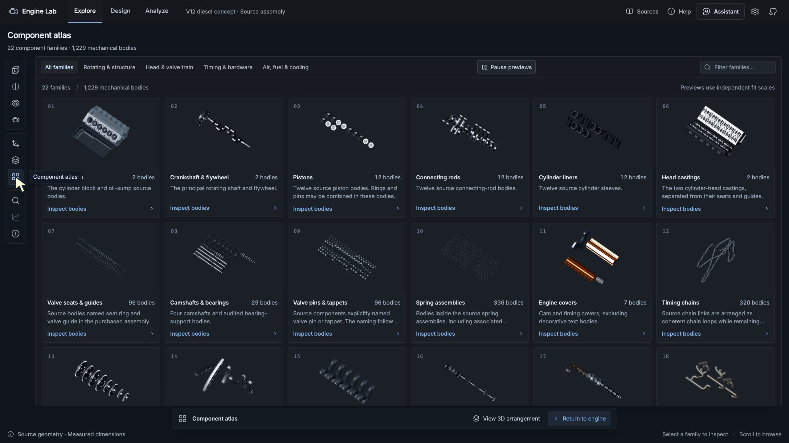

# Engine Lab

An interactive engineering workspace for exploring a V12 diesel concept, inspecting its mechanism, and connecting parametric geometry to numerical evidence.



[Run locally](docs/RUNNING.md) · [Architecture and WebGPU](docs/COMPUTE_ARCHITECTURE.md) · [Deployment](docs/DEPLOYMENT.md) · [Engineering scope](#engineering-scope)

## Three connected workspaces

| Workspace   | What it does                                                                                                                                                                                           |
| ----------- | ------------------------------------------------------------------------------------------------------------------------------------------------------------------------------------------------------ |
| **Explore** | Inspect 1,229 mechanical bodies across 22 component families. Run the mechanism, isolate parts, move a section plane, reveal internals with X-ray, separate the assembly, or open the component atlas. |
| **Design**  | Adjust a generated cranktrain and connecting-rod family. Link geometry to displacement, piston motion, mass and section properties. Screen a bounded design space and compare feasible samples.        |
| **Analyze** | Derive prescribed operating loads. Mesh and solve a generated rod, compare stress/displacement fields, refine the mesh, and preserve the result with its inputs.                                       |

The AI assistant can find source components, operate the real viewer and explain cited evidence. Design assistance can discuss the current study and its limits. A phase-linked cylinder study exposes pressure–volume plots and numerical checks in Explore. Guided lessons use the same scene controls as manual exploration.

### Inspection and process views

<table>
  <tr>
    <td><a href="docs/images/section-inspection.webp"></a><br /><strong>Movable cross-section</strong><br />Filled cut faces preserve the inspected geometry.</td>
    <td><a href="docs/images/mechanism-processes.webp"></a><br /><strong>Connected mechanism and processes</strong><br />Flow and combustion layers share the mechanical phase.</td>
  </tr>
  <tr>
    <td><a href="docs/images/parametric-cranktrain.webp"></a><br /><strong>Parametric geometry</strong><br />Dimensions, measurements and plots update together.</td>
    <td><a href="docs/images/solid-analysis.webp"></a><br /><strong>Native solid analysis</strong><br />Computed fields, explicit loads and mesh-refinement evidence.</td>
  </tr>
</table>

<details>
<summary>Component atlas</summary>



The atlas groups the same component identities used by selection, isolation and the AI guide. Gallery previews have independent fit scales; assembly views preserve component scale.

</details>

These are actual application captures. [Screenshot provenance](docs/images/README.md) records their source frames and display settings. Process overlays are illustrative; deformation amplification changes presentation, not computed values.

## Run locally

**Source availability:** this README describes the current development working tree. At the 30 September 2026 audit, public `main` still contained the initial boilerplate commit. A public clone alone did not contain the demonstrated application. Publication of the current code and a reproducible V12 asset-preparation pipeline remain separate release steps.

For a checkout containing the application, use **Node 24** and **pnpm 12.4.2**. The recorded environment used Node 24.21.0. Python is optional unless you need exact CAD or native solid analysis.

```sh
cd /path/to/Diesel
npm install --global pnpm@12.4.2
pnpm install --frozen-lockfile
# For a new checkout only; preserve an existing .env.
test -f .env || cp .env.example .env
pnpm dev --host 127.0.0.1
```

Open the address printed by Vite, normally **http://127.0.0.1:5173**. The workspaces are `/`, `/design` and `/design?workspace=analyze`.

The full Explorer also requires the licensed runtime asset bundle in `static/models/`. The base model, refined cams, clearance corrections and chamber domains must match this application version. These files are intentionally excluded from Git; a key or package installation cannot replace them. The generated Design/Analyze workspace does not load the purchased engine mesh, although the checkout still needs its source metadata imports to build.

The [complete rerun guide](docs/RUNNING.md) covers assets, Python installation, optional AI credentials, production startup, verification and troubleshooting.

### Optional services

| Capability                                                  | Requirement                                                           |
| ----------------------------------------------------------- | --------------------------------------------------------------------- |
| Viewer, mechanism, browser calculations and design searches | JavaScript dependencies; licensed runtime geometry for Explore        |
| AI guide and spoken explanations                            | OpenAI access through a server key or the app's optional BYOK flow    |
| Exact solid verification and STEP export                    | Python 3.12 environment with the pinned OCP dependencies              |
| Tetrahedral solid FEA and refined candidate comparisons     | Python environment with OCP, Gmsh, NumPy, SciPy, scikit-fem and PyAMG |

The AI key does not enable or pay for the numerical solver. ElevenLabs narrated the video tour; it is not an application runtime dependency.

## Where the work runs

| Layer                        | Current implementation                                                                        | Execution                                  |
| ---------------------------- | --------------------------------------------------------------------------------------------- | ------------------------------------------ |
| Interface                    | Svelte 5, SvelteKit 2, TypeScript, Hugeicons                                                  | Browser and Node server                    |
| 3D rendering                 | Three.js WebGL renderer, physical materials, lighting, shadows, clipping and section caps     | Browser GPU                                |
| Process visualization        | GLSL flow shaders and ray-marched chamber volumes                                             | Browser GPU; illustrative fields           |
| Mechanism and cylinder study | Measured linkage geometry, declared timing, ideal-gas mass/energy integration with RK4        | Browser CPU                                |
| Parametric screening         | Generated geometry properties, beam equations, independent matrix checks and bounded searches | Browser CPU; searches use Web Workers      |
| Exact CAD and solid FEA      | Open CASCADE/OCP, Gmsh, scikit-fem, SciPy and PyAMG                                           | Native Python subprocesses started by Node |
| AI                           | OpenAI Codex SDK, validated commands, scene state and browser acknowledgements                | Persistent Node process and OpenAI API     |

### WebGPU status

**Rendering already uses the GPU. Numerical WebGPU compute is not implemented.** The current application has no JAX-JS dependency and does not use Three.js `WebGPURenderer`.

The next useful GPU-compute target is batched operating-envelope and design screening, followed by parameter sensitivities. JAX-JS could run those kernels alongside the existing WebGL viewer. Independent double-precision calculations and native FEA would remain reference checks. Migrating the renderer is separate work because the sectioning and volumetric materials use custom WebGL shaders.

See [compute architecture and the proposed WebGPU sequence](docs/COMPUTE_ARCHITECTURE.md) for implementation boundaries, precision constraints and acceptance criteria. No GPU speedup or differentiable full-engine solver is claimed by this release.

## Hosting

This is a **Node application with backend components**. GitHub Pages cannot run the Codex process, scene broker, CAD kernel or Python FEA service.

At the 30 September 2026 audit, the repository had **no GitHub Pages site, no Actions workflows and no deployment records**. GitHub Actions could later build, test and deploy the application to a suitable host; it is not the runtime host itself.

The current hosting shape is one persistent Node instance behind HTTPS, with a native Python environment for full analysis. Scene sessions and AI access accounting are process-local. The existing Dockerfile provisions Node and the Codex runtime, but **does not provision Python/CAD/FEA** and has not been accepted as a complete production image. A static-only edition, stateless deployment or multiple replicas requires additional implementation.

See [deployment requirements](docs/DEPLOYMENT.md) before hosting an invited demo. No public live-demo URL is currently available.

## Engineering scope

The source is a purchased **60° V12 diesel concept**, measured at **85 mm bore × 100 mm stroke**, approximately **6.81 L** swept volume. It is not an OEM production master or a validated engine rating.

- **Source and derived geometry:** original asset files are retained separately. Corrections to timing, valve-train and clearance geometry are documented. Display finishes do not identify physical material grades.
- **Motion:** a connected 720° teaching cycle drives the cranktrain and valve train. Playback speed is distinct from operating RPM; turbo speed is illustrative. Production firing order and hot-running clearances are not established by the model.
- **Processes:** intake/exhaust fields, reduced fuel spray and combustion glow explain route and timing. They do not predict emissions, calibrated flame temperatures or fuel consumption.
- **Parametric scope:** the generated cranktrain and rod family adapt to their parameters. The entire purchased assembly is not regenerated or proven compatible with those changes.
- **Analysis:** the ideal-air cylinder model, beam screen, prescribed-pressure operating loads and native linear-elastic solid solver are separate models. Their assumptions and fixtures must accompany their results.
- **Design comparisons:** sampled mass/deflection tradeoffs are numerical evidence under declared conditions. Bearing contact, fatigue, thermal stress, nonlinear behavior, manufacturing detail and experimental validation remain outside the demonstrated capability.

## Controls

| Action                               | Control                    |
| ------------------------------------ | -------------------------- |
| Orbit / zoom / pan                   | Drag / scroll / right-drag |
| Isolate a component                  | Double-click it            |
| Run or pause                         | `Space`                    |
| Explode or assemble                  | `E`                        |
| Component atlas                      | `G`                        |
| Section or assembly                  | `C`                        |
| Fit the current view                 | `F`                        |
| Stop the current interaction or tour | `Esc`                      |

## Verification

```sh
pnpm exec playwright install chromium chrome
pnpm check
pnpm test:unit --run
pnpm test:e2e
pnpm build
```

The full suite needs the runtime assets; browser scenarios also exercise real native analyses. Some AI regression tests use mocks. Historical passing counts and hardware measurements are recorded with their context in the engineering reports; they are not a current CI badge. [Testing requirements and native checks](docs/RUNNING.md#verification) explain how to reproduce them.

## Project map and technical documentation

| Path or document                                                     | Purpose                                                             |
| -------------------------------------------------------------------- | ------------------------------------------------------------------- |
| [`src/lib/scene`](src/lib/scene)                                     | Rendering, motion, sections, material and process presentation      |
| [`src/lib/engine`](src/lib/engine)                                   | Engine identity, measured data, timing and cylinder calculations    |
| [`src/lib/design`](src/lib/design)                                   | Parametric geometry, mechanics, search workers and result contracts |
| [`src/lib/server`](src/lib/server)                                   | AI access, scene broker, native CAD and structural services         |
| [`src/lib/server/cad`](src/lib/server/cad)                           | Exact-solid generation, meshing, elasticity and verification        |
| [`tests`](tests)                                                     | Browser regression scenarios                                        |
| [Running-engine implementation](docs/V12_RUNNING_ENGINE_RELEASE.md)  | Motion inventory, process models and checks                         |
| [Cylinder-cycle equations](docs/V12_AIR_STANDARD_CYCLE.md)           | Numerical formulation and assumptions                               |
| [Parametric design](docs/PARAMETRIC_DESIGN_IMPLEMENTATION.md)        | Generated family, searches and verification history                 |
| [Operating-load verification](docs/OPERATING_DESIGN_VERIFICATION.md) | Pressure assumptions, rigid-body mechanics and comparison           |
| [Native solid FEA](docs/DESIGN_SOLID_FEA.md)                         | Elements, boundary conditions, residuals and refinement             |
| [CAD export](docs/DESIGN_CAD_EXPORT.md)                              | Geometry contract, solid validity and STEP round trip               |

Earlier Caterpillar research and superseded implementation notes are historical. They do not supply operating specifications for the current generic V12.

## Source asset and acknowledgements

The purchased engine is [V12 Quad Turbocharged Diesel Engine by Y-Studio19](https://www.cgtrader.com/3d-models/industrial/industrial-machine/v12-quad-turbocharged-diesel-engine-cf492efc-f63a-4c18-86c7-d3bd0948c20d). Its commercial geometry and derived runtime assets are not included for redistribution. Screenshots do not grant rights to the underlying model.

Built with [SvelteKit](https://svelte.dev/docs/kit/introduction), [Three.js](https://threejs.org/), [Hugeicons](https://hugeicons.com/), [OpenAI Codex](https://github.com/openai/codex), [Open CASCADE](https://dev.opencascade.org/), [Gmsh](https://gmsh.info/) and [scikit-fem](https://github.com/kinnala/scikit-fem). Third-party packages and assets retain their respective licences.
