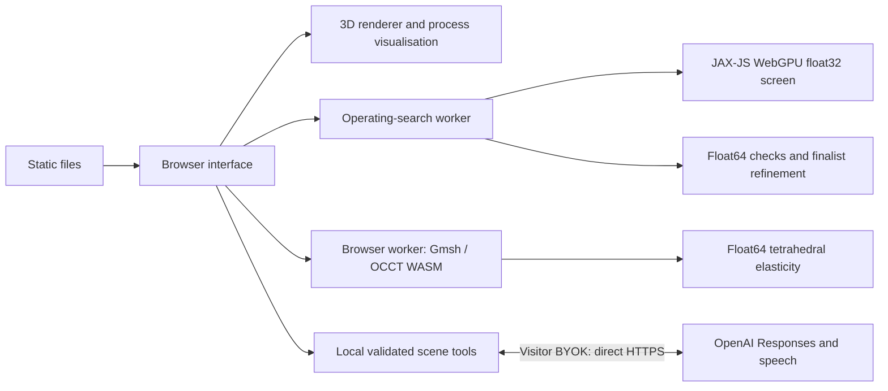

# Browser computation and verification

Status: **1 October 2026**, browser application on `main`. Engineering computation has moved into the browser. Native WebGPU graphics and JAX-JS numerical WebGPU screening are implemented and verified separately.

## Execution boundaries

There is no application server between these stages. A static host serves bytes; Node is used for development, building and tests. Historical Python/native implementations remain comparison references and are not browser runtime dependencies. OpenAI language/audio inference is remote; scene execution and numerical calculations are local.

| Work                                        | Implementation                                                      | Execution                                                                    |
| ------------------------------------------- | ------------------------------------------------------------------- | ---------------------------------------------------------------------------- |
| Linkage and measured kinematics             | `src/lib/engine/v12-kinematics.ts`, `v12-analysis.ts`               | Browser JavaScript                                                           |
| Declared cylinder cycle                     | `src/lib/engine/v12-cylinder-cycle.ts`                              | Ideal-air mass/energy integration, RK4 on browser CPU                        |
| Parametric properties and reference screens | `src/lib/design/design-core.ts`, `operating-cycle.ts`               | Analytic/Float64 browser calculations                                        |
| Operating design search                     | `src/lib/design/gpu-operating-kernel.ts`, `gpu-operating-search.ts` | JAX-JS WebGPU batch plus Float64 verification/refinement; local CPU fallback |
| Exact rod solid and STEP                    | `src/lib/browser-cad/kernel.ts`                                     | Open CASCADE via Gmsh WebAssembly in a module worker                         |
| Solid elasticity                            | `src/lib/browser-cad/analysis.ts`, `elasticity.ts`                  | Gmsh WASM mesh; browser Float64 sparse assembly and IC(0)-PCG                |
| Assistant                                   | `src/lib/ai/client.ts`, `scene.ts`, `design.ts`                     | Browser Responses loop; direct remote OpenAI inference                       |

## Implemented numerical WebGPU

The accelerated kernel batches **design × operating condition × crank angle × rod section**. JAX-JS 0.1.25 evaluates rigid-body endpoint forces and nominal section stress in float32. Exact geometry integrals, shared prescribed pressure/kinematics and finalist refinement remain Float64 browser work. This is an operating-load screen, not a GPU combustion solver or a GPU tetrahedral elasticity solve.

The coarse screen uses 121 phases per condition and 17 rod sections. A typical 500-design, three-condition batch therefore performs **3,085,500 section evaluations**. Five spread-out designs are checked independently in Float64 before ranking. Designs close to the utilisation threshold are conservatively recomputed. Finalists use 721 crank-angle samples. The comparison tolerance is `3e-4`, with a threshold guard at twice that value.

If WebGPU is unavailable, device initialisation fails, or GPU/reference agreement fails, the same worker uses the independent Float64 CPU search. Cancellation and stale-result guards remain active. Saved study provenance records backend, precision, device, validation count/error, timing and fallback reason. A GPU label is based on the executed path, not just `navigator.gpu` availability.

Automatic compute also selects this Float64 path when the adapter explicitly identifies itself as software, such as SwiftShader. Compiling GPU kernels for CPU emulation offered no acceleration and stalled a Linux CI run. Unknown and physical adapters retain the WebGPU path; an explicit WebGPU request still exercises that path for diagnostics. This numerical choice does not change the native WebGPU renderer. Linux CI verifies that renderer on its software driver; the separately recorded physical-adapter checks establish numerical GPU execution and agreement.

### Recorded browser measurements

[The complete machine-readable report](verification/browser-webgpu.json) was captured in Chrome 154 on an `apple / metal-3` WebGPU adapter. Each of three 500-design cases was compared candidate-by-candidate against the independent Float64 implementation. Pass/fail decisions and finalist identities agreed in all three cases.

| Case                                  | GPU-path total | CPU-path total | Largest all-candidate relative error |
| ------------------------------------- | -------------: | -------------: | -----------------------------------: |
| Reference, three operating conditions |       194.1 ms |       527.6 ms |                            `3.79e-7` |
| Maximum bore and speed                |        57.2 ms |       490.1 ms |                            `4.05e-7` |
| Short rod, zero speed                 |       102.4 ms |       160.6 ms |                            `1.18e-7` |

These are wall-clock task measurements on one machine, including preparation, verification and finalist work; they are not pure GPU timestamp measurements or universal speed guarantees. Browser caches, device compilation, concurrent rendering and batch size affect results. The report separately records a fresh-worker run and confirms no backend requests.

Run `node scripts/verify-webgpu.mjs --output /tmp/engine-lab-webgpu.json` to launch the development harness and repeat the checks in Chrome. A supported physical/software GPU adapter must actually be available for a GPU result.

JAX-JS supports multiple array backends, but its [operation/precision compatibility](https://github.com/ekzhang/jax-js/blob/main/FEATURES.md) matters: WebGPU float32 does not replace Float64 reference calculations. The current mass-sensitivity view uses bounded finite differences of the analytic rod evaluation. Automatic differentiation of operating or solid objectives and broader sensitivity visualisations remain future work; dependency support alone does not establish that they are implemented.

## Browser CAD and solid elasticity

The authored rod’s five geometry parameters produce a real OCCT solid: two eyes, three I-section layers and two through-bores. The browser checks one connected volume against an independent analytic union-volume calculation. STEP export retains curved analytic faces and is imported back into the kernel for a solid-count/volume round trip.

Gmsh constructs a conforming first-order tetrahedral mesh of that same domain. The elasticity worker assembles a Float64 sparse CSR matrix, diagonally scales it, and solves with incomplete-Cholesky IC(0)-preconditioned conjugate gradients. The problem retains the fixed big-bore fixture, cosine-weighted small-bore traction and optional consistent D’Alembert rigid-body inertia. It returns actual solved fields, reactions, energy, residuals and volume-weighted stress statistics. It does not substitute a beam solution for a solid field.

Checks include an affine displacement patch, rigid-motion invariance, rejected collapsed elements, baseline/bound-extreme STEP exports, independent remeshing comparisons and three-level refinement with inertia. Browser/reference displacement differences were **−0.4784%** for the baseline and **+0.0485%** for a thin inertial candidate. Different Gmsh versions produce different meshes; comparisons concern integral responses, not matching node indices.

In the recorded browser worker run, a two-level calculation produced **11,897 tetrahedra / 3,784 nodes**, a true residual of **`7.89e-11`**, and force/moment equilibrium errors below **`3e-11`**. Geometry, both meshes and solves took about **1.22 seconds** after module loading on that machine. A separate static UI test exported STEP and displayed a solved load case with `/api` returning 404. [Full verification and limitations](verification/browser-cad-solid.md) accompany [the raw report](verification/browser-cad-solid.json).

The approximately 40 MB WASM module loads on the first CAD/FEA request. The worker is reused; cancellation terminates it and the next request starts cleanly. The mesh budget is 45,000 nodes / 160,000 tetrahedra. Nonconvergence, invalid volumes and failed equilibrium checks are errors, not accepted results. The threaded WASM build requires cross-origin isolation; see [deployment](DEPLOYMENT.md).

This stage deliberately uses browser CPU Float64 and WASM. It is not a WebGPU FEA solver. Sharp edges and fixed fixtures retain stress singularities; an integral refinement gate is not proof of pointwise stress convergence or physical durability.

## Native WebGPU graphics

Every live viewport now initializes a real Three.js WebGPU backend: Explorer, source review, component-atlas previews, parametric geometry and solid comparison. The initializer disables Three.js’s automatic WebGL fallback and reports unsupported devices explicitly. The source assembly, motion, X-ray, sections, explosion and arranged views have been exercised on the actual backend; [runtime snapshots](verification/webgpu-engine-smoke.json) record the executed backend and scene state. [Atlas checks](verification/webgpu-atlas-smoke.json) cover visible/scrolled preview viewports.

The process layers use node materials and WGSL ray-march functions. Soft passage tracers and fuel parcels use instanced sprite billboards because WebGPU point primitives have a one-pixel size. The GPU verification exercises movement, visibility, section clipping and opaque-depth occlusion. [Implementation and compatibility details](verification/process-webgpu.md) explain the depth/stencil sampling contract; [pixel-test evidence](verification/process-webgpu.json) records the checks. Volume presentation remains educational, not reacting CFD.

The relevant upstream contract is [Three.js WebGPURenderer](https://threejs.org/docs/pages/WebGPURenderer.html). The prior GLSL and `onBeforeCompile` paths were replaced explicitly rather than assumed compatible. These checks establish the tested implementation, not universal browser/device support or a fixed frame-rate guarantee. Public deployment acceptance is a separate final-origin check.

That [public-origin acceptance check](verification/public-pages.md) passed on 1 October 2026 for release `fc63ea2`. Fresh Chrome contexts loaded the complete protected model, used native WebGPU without WebGL contexts, and established cross-origin isolation through the Pages service worker. The hosted JAX-JS search executed on an Apple Metal adapter; browser CAD, STEP and all four refined structural cases completed without application API requests. Phone inspection loaded the screenshot without engine resources or WASM.

## AI and retained historical code

The native Codex process and HTTP/MCP scene broker are removed from the deployed runtime. The browser owns the Responses tool loop, exact component IDs, revision validation, checkpoints, serial commands and visual acknowledgements. It sends only bounded context/summaries to OpenAI using the visitor’s in-memory key. Narration uses a direct speech request. No shared app key is embedded or proxied.

The historical Node/Python code and saved numerical fixtures remain useful references. Their presence in the repository or a test project named `server` does not make them deployment requirements. [The archived architecture](archive/COMPUTE_ARCHITECTURE_NODE_BASELINE.md) documents the superseded paths.

Remaining engineering extensions include differentiated operating/solid objectives, a wider parametric geometry family, contact/nonlinear/fatigue/thermal models and any reacting-flow calculation. None is implied by the current renderer, optimizer or library selection.
