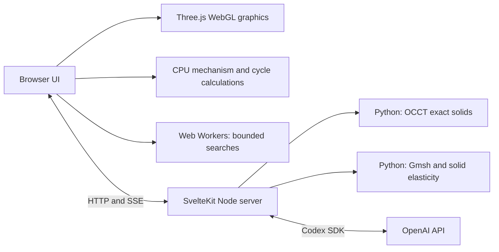

> Historical Node/Python baseline, preserved on 1 October 2026. These are superseded instructions, not the browser-first setup. See the [current README](../../README.md) and [current running guide](../RUNNING.md).

# Compute architecture and WebGPU

This document distinguishes implemented execution paths from proposed GPU work. Status checked on 30 September 2026.

## Current execution paths

| Work                                | Implementation evidence                                              | Where it runs                                                          |
| ----------------------------------- | -------------------------------------------------------------------- | ---------------------------------------------------------------------- |
| Engine, atlas and design rendering  | `src/lib/scene/v12-studio.ts`, `design-studio.ts` and atlas renderer | Browser GPU through Three.js WebGL                                     |
| Flow envelopes and chamber volumes  | `src/lib/scene/directed-flow-volume.ts`, `v12-chamber-volume.ts`     | GLSL fragment work, including visual advection and volume ray marching |
| Cylinder cycle                      | `src/lib/engine/v12-cylinder-cycle.ts`                               | Browser CPU, RK4 integration of mass and internal energy               |
| Geometry properties and beam screen | `src/lib/design/design-core.ts`                                      | JavaScript number/Float64 calculations on CPU                          |
| Design-space searches               | Workers under `src/lib/design`                                       | Browser CPU workers, separate from the UI thread                       |
| Exact solid and STEP                | `src/lib/server/design-cad.ts`, `cad/rod_step.py`                    | Native Python/OCP launched by Node                                     |
| Tetrahedral elasticity              | `src/lib/server/design-structural.ts`, `cad/rod_elasticity.py`       | Native meshing, sparse assembly and solution                           |

Rendering and process visualization already use GPU shaders. The shader effects are distinct from the engineering solver: animating a flow field does not establish a transient CFD calculation.

There is currently no JAX-JS package, WebGPU numerical backend or Three.js WebGPU renderer in the app.

## Proposed first implementation: batched engineering calculations

The strongest initial candidate is the repeated numerical work across **geometry × operating condition × crank angle**. It has a clearer validation target than replacing the complete CAD/FEA pipeline.

1. **Establish a benchmark and reference contract.** Preserve the existing CPU implementation and its units, parameter bounds, equations and case identifiers. Measure realistic batch sizes and complete user-visible latency, including data transfer and compilation.
2. **Port smooth screening kernels.** Batch slider-crank derivatives, generated mass/inertia, cycle bearing loads and beam responses. Use the GPU for sufficiently large batches, with CPU/Wasm fallback for unsupported hardware and small cases.
3. **Add sensitivity views.** Differentiate the supported smooth kernels to show how mass, load and displacement respond to each parameter. Compare automatic derivatives with finite differences. Discrete feasibility and selected extrema need explicit treatment; they are not automatically smooth objectives.
4. **Keep native finalist checks.** Regenerate exact solids and independently mesh/solve selected candidates with the existing native service. GPU screening does not replace the current residual, reaction and refinement checks.
5. **Consider reduced-order fields and further physics only after validation.** A surrogate needs a documented training domain and error bounds. Thermal or flow models need boundary conditions and benchmark cases before they can support engine-efficiency claims.

[JAX-JS](https://github.com/ekzhang/jax-js) provides differentiable array operations and compilation across browser backends. Its [compatibility table](https://github.com/ekzhang/jax-js/blob/main/FEATURES.md) documents `jit`, differentiation and operation-dependent `vmap` support. It is not a drop-in port of Python JAX. Float64 is supported on CPU/Wasm but not on its WebGPU backend; a float32 port therefore needs deliberate nondimensionalization, conditioning checks and error tolerances against the current reference results.

Automatic differentiation applies to kernels actually expressed in the supported array operations. It will not differentiate the purchased asset, Open CASCADE topology operations or Gmsh remeshing automatically. Exact CAD can remain on the server while a differentiable screening model operates in the browser.

### Acceptance criteria

- Compare randomized and boundary parameter cases against the independent CPU reference; report absolute and relative errors with units.
- Check gradients against finite differences, including behavior near active constraints and phase extrema.
- Preserve case identity, cancellation, stale-result handling and exports when switching backends.
- Measure cold compilation, repeated calculation time, transfers, memory, and frame cadence while the engine is moving. The renderer and compute backend share the user's GPU.
- Retain a functional fallback and show which backend produced a result. Do not claim acceleration until the measured end-to-end task improves.

The current searches contain hundreds or a few thousand candidates. Their size alone does not guarantee a GPU win; launch/transfer overhead can dominate small kernels. Larger operating maps and uncertainty sweeps are stronger candidates for batching.

## Renderer migration is a separate project

Three.js offers [WebGPURenderer](https://threejs.org/docs/pages/WebGPURenderer.html), including a WebGL2 fallback. The existing app has custom GLSL volumes, clipping/cap behavior and shader customizations. Three documents [`onBeforeCompile`](https://threejs.org/docs/pages/Material.html#onBeforeCompile) as a WebGL renderer feature; a migration needs node-material/TSL equivalents and visual regression checks.

Test material appearance, sections, X-ray fades, flow direction, picking, shadows and performance across the supported browsers before changing the default renderer. A WebGPU compute prototype can coexist with the current WebGL viewer, so renderer migration does not need to block the first numerical experiment.

## Hosting remains an independent concern

GPU screening would reduce some backend work, but it would not remove the current native CAD/FEA services, private AI credentials or process-local scene broker. GitHub Pages remains insufficient for this full application. A static edition would require an explicit feature boundary and a different server/service arrangement. See [deployment](../DEPLOYMENT.md).
