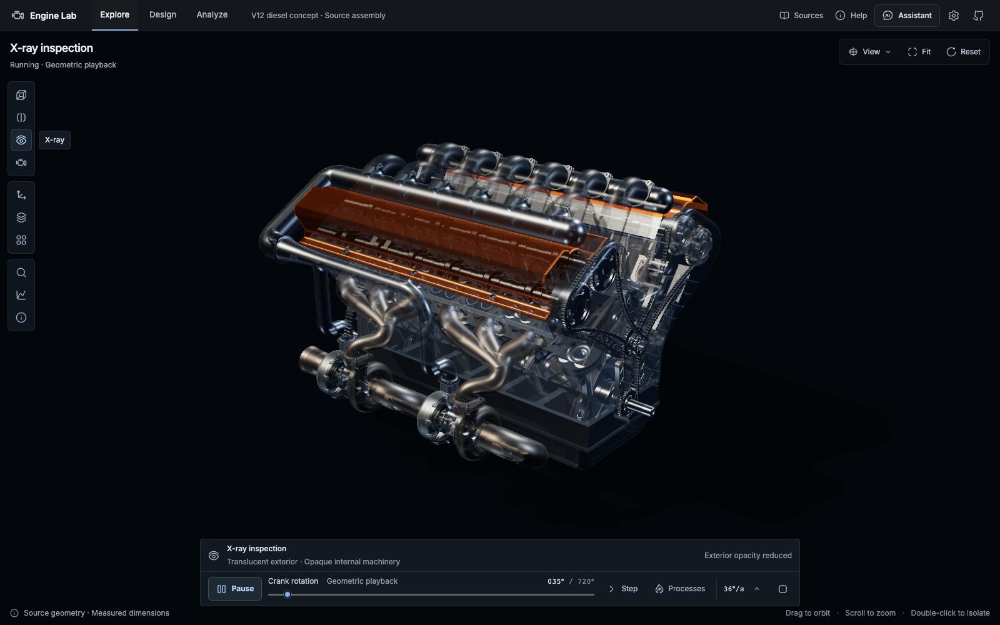
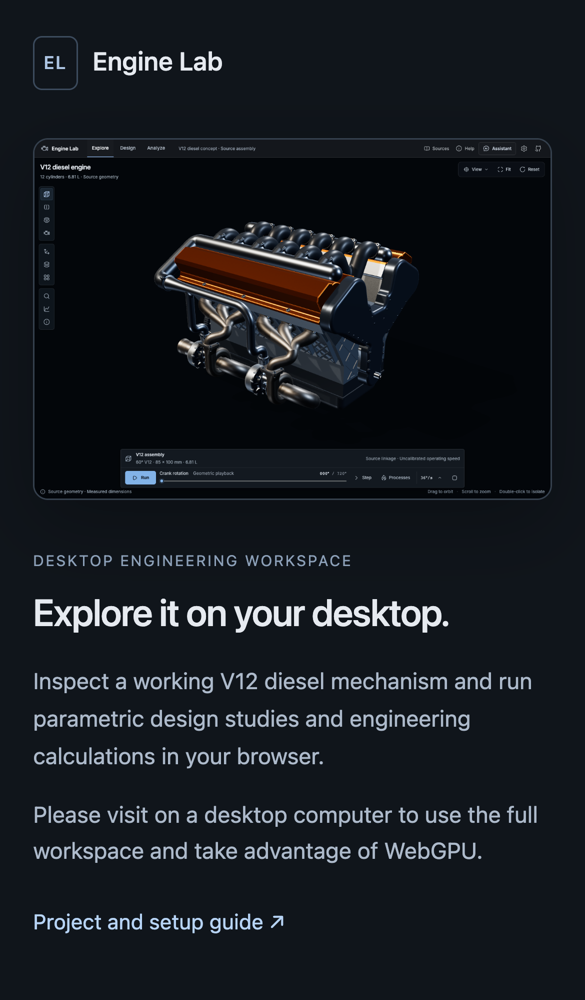

# GitHub Pages release acceptance

Verified on **1 October 2026**, beginning at **06:41 UTC**, against **https://neovand.github.io/Diesel/** in a fresh desktop Chrome context. Release: `fc63ea2ad54e7399bb6285a3f066e1baa0e9d917` on `main`.

The [Pages workflow](https://github.com/NeoVand/Diesel/actions/runs/36825264191) completed its verification, production build and deployment successfully. A separately downloaded artifact from that exact run matched the public root page, both Design URLs and isolation service worker byte-for-byte. [Deployment provenance](public-pages-provenance.json) records hashes and MIME checks; [browser evidence](public-pages.json) records the actual calculations and runtime observations.

## Published model and rendering

The fresh profile loaded the complete protected resource package. It exercised running motion, X-ray, X/Y/Z sections, all four process channels, exploded assembly, arranged parts and the component atlas. Running canvas frames changed. Observed 3D contexts were native `webgpu`; no `webgl` or `webgl2` context, uncaptured GPU validation error, device loss or browser error was recorded.

The desktop page and the separately navigated Design page both reported `crossOriginIsolated: true`, controlled by `/Diesel/coi-serviceworker.js`. The origin does not supply COOP/COEP headers directly; the shipped worker establishes the required browser environment.

There were **zero failed HTTP responses**, **zero application `/api/` requests**, and **zero loose geometry-file requests** in this acceptance session. Model decoding occurs locally. [The resource audit](asset-package-audit.md) separately confirms all five resources and all source bodies, and explains the licensing and extraction limitations.

## Actual browser calculations

The exact rod check returned one connected OCCT solid. Relative volume disagreement against the analytic expression was `3.64e-16`; STEP round-trip volume disagreement was `4.46e-14`. The real **54,596-byte STEP export** contained ISO 10303 and manifold solid B-rep records.

The operating search executed on **JAX-JS WebGPU, `apple / metal-3`**, with float32 screening and independent Float64 verification. It evaluated **500 designs × 3 conditions × 121 phases × 17 sections = 3,085,500 section evaluations**. Five distributed designs were independently checked; maximum relative error was **`1.064e-7`**, below the `3e-4` tolerance. Total measured search time was **415.3 ms**, including preparation, checks and finalist work. This is one machine/run, not a universal timing guarantee.

Reference and candidate each received two actual structural load cases, with independently generated meshes and refinement. All four completed using the browser Float64 IC(0)-PCG solver and Gmsh WebAssembly:

| Geometry / case        | Refined nodes | Tetrahedra | Relative solve residual | Displacement refinement change | Energy refinement change |
| ---------------------- | ------------: | ---------: | ----------------------: | -----------------------------: | -----------------------: |
| Reference, compression |         3,784 |     11,897 |              `1.02e-10` |                         0.122% |                   0.357% |
| Reference, tension     |         3,784 |     11,897 |              `8.73e-11` |                         3.877% |                   3.449% |
| Candidate, compression |         7,766 |     28,473 |              `1.03e-10` |                         0.496% |                   0.325% |
| Candidate, tension     |         7,766 |     28,473 |              `1.25e-10` |                         6.459% |                   5.548% |

Maximum force-balance error was `3.13e-11`; maximum moment-balance error was `4.08e-12`. All cases met the declared 8% integral-response screening criterion. That criterion does not establish asymptotic stress convergence, fatigue life, contact behavior or manufacturing suitability. Materials, pressure inputs and fixtures remain the declared model assumptions. Solid FEA uses browser CPU/WASM, not WebGPU.

## Phone boundary

A separate fresh iPhone 13 browser profile showed the desktop guidance and its 1440 × 1000 source image. It created **zero canvases** and requested **no engine-resource chunks, GLB files or WASM modules**. This check concerns the phone presentation and resource boundary; it is not a mobile numerical-solver test.

## CI and scope

The same release passed type checking, **520 public unit tests** and **8/8 static-browser tests** on GitHub. Ten tests requiring private licensed fixtures were explicitly skipped there; local verification with those fixtures passed all 530 tests.

Linux CI verified WebGPU graphics using SwiftShader. Its numerical search selected the full browser Float64 implementation because the adapter explicitly reported software execution, preserving the reason in [the exported CI computation record](public-ci-computation.json). This is distinct from the physical-GPU calculation above. No assertion was weakened to label CPU work as GPU work.

The automated public acceptance run did not make paid AI requests. Actual direct OpenAI scene actions and design replies are checked separately during the live-site tour capture. Provider inference is remote; scene control and engineering calculations are local. The current measurements establish this release on the recorded environment, not OEM physical validation or universal browser support.
